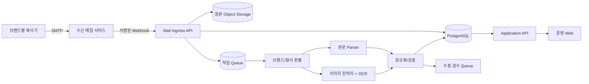

# 시스템 아키텍처

## 범위와 경계

시스템은 이메일 수신부터 정규화된 카운터 스냅샷 생성, 운영자 검수, 조회와 집계까지
담당합니다. 복사기 설정 변경, 고객사 과금, 회계 전표 생성은 초기 범위에 포함하지 않습니다.



## 컴포넌트 책임

### Mail Ingress API

- Provider의 Webhook 서명을 검증하고 허용된 수신 주소인지 확인합니다.
- RFC Message-ID와 원본 SHA-256으로 중복 수신을 차단합니다.
- MIME을 파싱하기 전 크기, 파일 개수, 허용 MIME 유형을 검사합니다.
- 원본을 Object Storage에 먼저 보관하고 DB transaction/outbox로 작업을 발행합니다.
- Webhook에는 빠르게 성공을 응답하고 OCR은 동기 실행하지 않습니다.

### Extract Worker

- 발신 주소만 신뢰하지 않고 수신 주소, 본문 표식, 첨부 특징을 조합해 Adapter를 선택합니다.
- 브랜드 Adapter는 공통 입력/출력 계약을 구현하며 Parser 버전을 결과에 기록합니다.
- 이미지 방향 보정, crop, 대비 조정 후 OCR을 실행합니다.
- 원문 문자열, 정규화 값, 좌표, OCR 엔진 버전과 신뢰도를 함께 남깁니다.
- 처리 단계는 멱등적이며 지수 backoff 후 Dead Letter Queue로 이동합니다.

### Validation/Review

- 음수, 이전 확정값보다 작은 누적값, 비현실적 증가량, 시리얼 불일치를 탐지합니다.
- 낮은 신뢰도나 규칙 위반은 `needs_review`로 보내고 집계에서 제외합니다.
- 운영자가 원본 이미지와 추출값을 나란히 보고 확정/수정/거부할 수 있습니다.
- 수정 전후 값과 작업자, 시간, 사유를 감사 로그에 기록합니다.

### Application API/Web

- 역할은 `admin`, `operator`, `viewer`로 분리합니다.
- 수집 성공률, 마지막 수집 시각, 검수 대기, 실패 사유를 대시보드로 제공합니다.
- 고객사 → 설치 장소 → 장비 → 스냅샷으로 탐색하고 CSV 내보내기를 지원합니다.
- 집계 수치에서도 원본 스냅샷과 메일로 drill-down 할 수 있어야 합니다.

## 주요 상태 흐름

```text
received → queued → extracting → needs_review → confirmed
                         └──────→ rejected
                 └─────────────→ failed (retry/DLQ)
```

상태 전이는 서버에서만 수행하고 각 전이를 `processing_events`에 append-only로 기록합니다.
`failed`는 종착 상태가 아니며 운영자의 재처리로 `queued`가 될 수 있습니다.

## API 초안

| Method | Path | 설명 |
| --- | --- | --- |
| `POST` | `/webhooks/mail/{provider}` | 메일 Provider 전용 수신점 |
| `GET` | `/api/v1/ingestions` | 상태/브랜드/기간별 수집 목록 |
| `GET` | `/api/v1/ingestions/{id}` | 원본 메타데이터, 추출/처리 이력 |
| `POST` | `/api/v1/readings/{id}/review` | 확정, 수정 또는 거부 |
| `GET` | `/api/v1/devices` | 시리얼/고객사별 장비 조회 |
| `GET` | `/api/v1/reports/monthly-usage` | 월간 장비별 사용량 |

Webhook을 제외한 API는 SSO/OIDC 인증을 요구하고 페이지네이션, 요청 ID, 일관된 오류
형식을 적용합니다. OpenAPI 문서를 계약으로 관리합니다.

## 비기능 요구사항(초기 SLO)

- 정상 이메일의 99%를 수신 후 5분 이내 처리(수동 검수 시간 제외)
- 월간 조회 API p95 2초 이하(초기 예상 데이터량 기준)
- 확인된 데이터 변경 이력 100% 기록
- DB 복구 목표: RPO 15분, RTO 4시간
- 원본 보존 기간과 삭제 정책은 고객 계약 및 관련 법 검토 후 환경별 설정

수치는 운영 데이터가 쌓이면 조정하며, SLO별 계측 지표와 경보를 함께 정의합니다.
