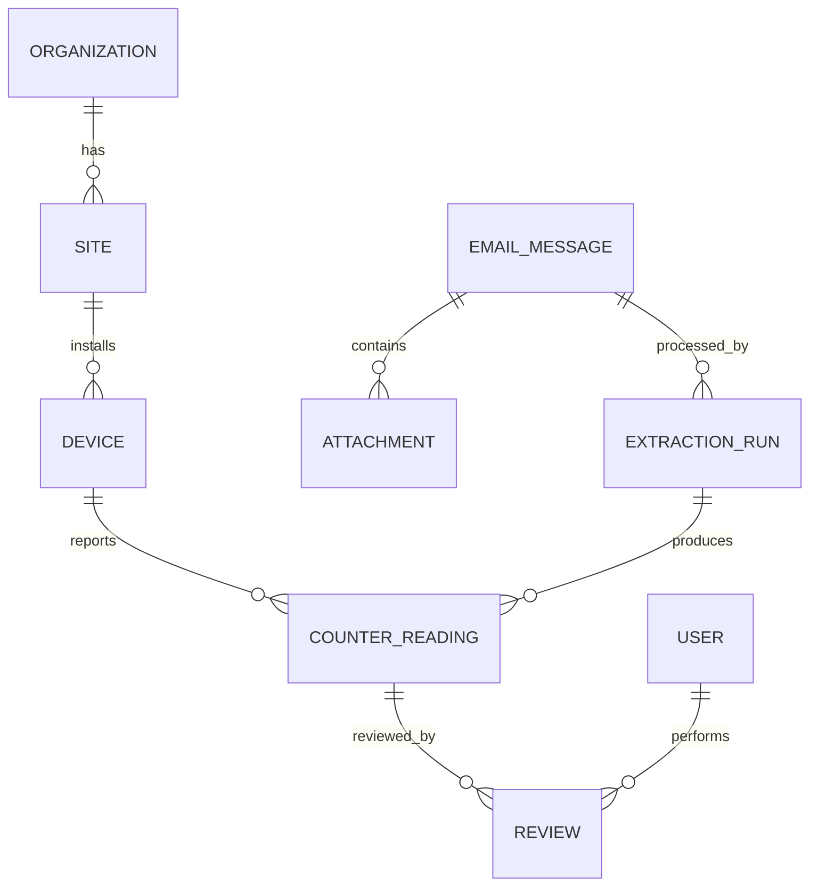

# 데이터 모델

## 관계

## 핵심 테이블

| 테이블 | 주요 필드 | 설명 |
| --- | --- | --- |
| `organizations` | `id`, `name`, `external_code`, `status` | 고객사 마스터 |
| `sites` | `id`, `organization_id`, `name`, `timezone` | 설치 장소 및 보고 기준 시간대 |
| `devices` | `id`, `site_id`, `brand`, `model`, `serial_number`, `installed_at`, `retired_at` | 시리얼은 정규화 후 유일성 보장 |
| `email_messages` | `id`, `message_id`, `sha256`, `sender`, `recipient`, `received_at`, `object_key`, `status` | 원본 위치와 처리 상태 |
| `attachments` | `id`, `email_id`, `sha256`, `mime_type`, `size_bytes`, `object_key` | 검사 완료 첨부 메타데이터 |
| `extraction_runs` | `id`, `email_id`, `adapter`, `adapter_version`, `ocr_engine`, `status`, `error_code` | 재처리마다 별도 실행 기록 |
| `counter_readings` | `id`, `run_id`, `device_id`, `counter_type`, `value`, `captured_at`, `confidence`, `status`, `raw_text` | 정규화된 누적 카운터 |
| `reviews` | `id`, `reading_id`, `reviewer_id`, `action`, `before_value`, `after_value`, `reason`, `created_at` | 수정 및 판단 이력 |
| `processing_events` | `id`, `email_id`, `from_status`, `to_status`, `metadata`, `created_at` | append-only 상태 감사 로그 |

## 제약과 인덱스

- `devices(serial_number)`는 대소문자, 공백, 구분자를 제거한 별도 정규화 컬럼에 unique
  제약을 둡니다. 제조사 간 충돌 가능성이 확인되면 `(brand, normalized_serial)`을 사용합니다.
- `email_messages(message_id)`와 `email_messages(sha256)`에 unique 제약을 둡니다.
- `counter_readings.value >= 0`, `confidence BETWEEN 0 AND 1`을 DB에서도 검사합니다.
- 동일 장비/유형/측정시각의 확정값은 partial unique index로 하나만 허용합니다.
- 조회를 위해 `(device_id, counter_type, captured_at DESC)`, 운영 Queue를 위해
  `(status, received_at)` 인덱스를 둡니다.
- 금액이 아닌 카운터도 부동소수 오차를 피하도록 `BIGINT` 또는 단위가 명시된 `NUMERIC`을
  사용합니다.

## 월간 사용량 계산

장비 `d`, 카운터 유형 `t`, 월 `m`에 대해 다음 두 값을 선택합니다.

- `start`: 월 시작 시각 이하에서 가장 가까운 confirmed 누적값
- `end`: 다음 달 시작 시각 이하에서 가장 가까운 confirmed 누적값
- `usage = end.value - start.value`

경계 직전 값이 없다면 월 안의 첫 값과 마지막 값으로 잠정 사용량을 표시하되
`is_complete=false`로 반환합니다. `end < start`, 장비 교체, 카운터 reset, 단위 변경은 자동으로
0 처리하지 않고 anomaly로 생성합니다. 고객사 장소의 timezone으로 월 경계를 정한 후 UTC로
조회합니다.

컬러/흑백, 복사/인쇄/스캔 등 제조사 원본 항목은 `counter_type_mappings`에서 표준 유형과
연결합니다. 원본 항목을 삭제하지 않아 추후 매핑 변경 시 재집계할 수 있게 합니다.

## 보존과 삭제

DB 레코드 삭제와 Object Storage 삭제를 하나의 작업으로 추적하며 부분 실패를 재시도합니다.
법적 보존 중인 데이터에는 삭제 작업을 적용하지 않습니다. 운영 DB에는 원본 이미지 binary를
직접 저장하지 않고 암호화된 Object Storage key와 checksum만 둡니다.
