# 배포 및 운영 설계

## 환경

`development`, `staging`, `production`을 별도 계정/네트워크/DB/bucket으로 분리합니다. 모든
환경은 같은 Container image를 사용하고 설정과 secret만 분리합니다. Infrastructure as Code로
네트워크, DB, queue, bucket, workload, alert를 재현합니다.

## GitHub 기반 흐름

현재 저장소의 `deploy-on-pr-merge.yml`은 `main` 대상 PR이 병합되면 운영 서버에 코드를
동기화한 뒤 Docker Compose 이미지를 다시 빌드하고 서비스를 재시작합니다. 서버의 `.env`는
동기화와 삭제 대상에서 제외해 운영 secret을 보존하며, 배포 마지막에는 web 컨테이너 내부에서
`/health`를 호출해 새 버전이 정상적으로 응답하는지 확인합니다. 운영 서버에는 Docker Compose가
설치되어 있어야 합니다. 배포 스크립트는 `.env`가 없거나 `APP_SECRET_KEY`가 비어 있을 때 Fernet
키를 자동 생성합니다. 이미 값이 있으면 형식만 검증하고 절대로 교체하지 않으므로, 배포 경로의
`.env`를 지속적으로 백업해야 합니다.

```mermaid
flowchart LR
    PR[Pull Request] --> CI[lint/test/security/build]
    CI --> Review[승인 및 merge]
    Review --> Image[Immutable image build + SBOM + signing]
    Image --> Stage[Staging deploy/migrate/smoke]
    Stage --> Approval[Production environment protection]
    Approval --> Prod[Rolling/Blue-Green deploy]
    Prod --> Verify[Health/SLO verification]
    Verify -->|실패| Rollback[이전 image rollback]
```

`main` 병합 직후 GitHub Actions가 배포를 시작하도록 하되 테스트와 staging 검증을 생략한다는
뜻으로 해석하지 않습니다. 동일 commit SHA의 immutable image만 승격하고 production은 GitHub
Environment의 승인, 브랜치 보호, OIDC 단기 자격증명을 적용합니다. 장기 서버 SSH key를
Repository secret에 저장하는 방식은 피합니다.

## Pipeline 필수 단계

1. Backend/Web lint, type check, unit 및 integration test
2. Golden email/OCR fixture 회귀 테스트
3. dependency, secret, SAST, container 및 IaC scan
4. commit SHA tag의 image build, SBOM 생성 및 서명
5. staging schema migration과 하위 호환성 검사
6. staging 배포 후 health/smoke test
7. production migration 후 rolling 또는 blue-green 배포
8. 오류율/지연/queue 적체 확인, deployment 기록 생성

초기 코드와 인프라가 결정되면 `.github/workflows/ci.yml`과 `deploy.yml`을 추가합니다. 빈 배포
스크립트나 특정 서버 자격증명을 설계 단계에서 가정하지 않습니다.

## 무중단 DB 변경

스키마는 expand-migrate-contract 순서로 변경합니다. 먼저 nullable 컬럼/새 테이블을 추가하고,
구·신 버전이 공존 가능한 코드를 배포한 뒤 backfill합니다. 사용 전환과 검증 후 다음 릴리스에서
구 컬럼을 제거합니다. migration은 backup과 rollback/roll-forward 절차 없이는 실행하지 않습니다.

## 관측성과 경보

- 모든 요청/메일/작업에 상관관계 ID를 전달하는 구조화 로그
- 수신량, 처리 지연, 성공률, 검수 대기, DLQ, OCR 비용 지표
- API latency/error, DB 연결, storage/queue 가용성 지표
- trace로 Webhook → worker → DB 흐름 연결
- SLO burn-rate, DLQ 발생, 마지막 정상 수신 지연, backup 실패 경보

경보에는 담당자, 심각도, dashboard와 runbook 링크를 포함합니다. 애플리케이션 health와
readiness를 분리하여 DB/queue 장애 시 신규 traffic을 안전하게 제어합니다.

## 백업과 복구

MariaDB binary log 기반 point-in-time recovery와 Object Storage versioning/lifecycle을 사용하고 서로 다른 장애
영역에 backup을 둡니다. backup 성공 알림만 신뢰하지 않고 분기별 격리 환경 복원으로 RPO/RTO를
검증합니다. 원본과 DB의 object key/checksum 정합성을 정기 점검합니다.

## Rollback

애플리케이션은 직전 서명 image로 즉시 되돌릴 수 있어야 합니다. 데이터 migration은 파괴적
rollback보다 forward fix를 기본으로 하며, 기능 flag로 새 Adapter/OCR을 브랜드별 중단할 수
있게 합니다. 잘못된 추출 결과는 삭제하지 않고 실행 버전을 비활성화한 뒤 원본에서 재처리합니다.
